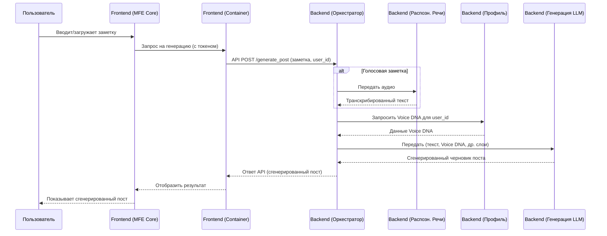

**Краткое Руководство по Разработке Платформы VOY (Voice Of You)**

**Версия:** 1.0 (MVP Focus)

**Содержание:**
1.  Концепция и Цели Проекта
2.  Архитектура Системы
    *   2.1. Общий Обзор
    *   2.2. Frontend (Vue 3 MFE)
    *   2.3. Backend (Go Микросервисы)
    *   2.4. База Данных (PostgreSQL)
3.  Ключевой Workflow: Генерация Поста
4.  Технологический Стек
    *   4.1. Frontend
    *   4.2. Backend
5.  Основные Функциональные Модули (MVP)
6.  Ключевые Экраны Пользовательского Интерфейса (Референс)
7.  Принципы Безопасности
8.  План Разработки (Фазы MVP)
9.  Начало Работы и Окружение

---

**1. Концепция и Цели Проекта**

*   **VOY (Voice Of You):** SaaS-сервис для генерации персонализированного контента (постов для соцсетей) на основе голосовых и текстовых заметок пользователя.
*   **Ключевая особенность:** Многослойная ИИ-генерация (структурный, персонализационный (Voice DNA), отраслевой, эмоциональный, трендовый слои) для создания аутентичного контента.
*   **Цель:** Обеспечить высокое качество контента при низких трудозатратах пользователя.
*   **Решаемые проблемы:** Нехватка времени на контент, потеря личного стиля при делегировании, отсутствие персонализации в ИИ-инструментах.
*   **Целевая аудитория:** Владельцы МСБ, эксперты, консультанты, авторы контента.

**2. Архитектура Системы**

    **2.1. Общий Обзор:**
    Модульная, масштабируемая система с независимым развитием Frontend и Backend.

    ```mermaid
    graph LR
        User[Пользователь] --> FE[Frontend (Vue3 MFE)]
        FE -- HTTPS/REST API --> BE_Orchestrator[Backend: Сервис Оркестрации (Go)]
        BE_Orchestrator --> BE_Auth[Сервис Аутентификации]
        BE_Orchestrator --> BE_Speech[Сервис Распознавания Речи]
        BE_Orchestrator --> BE_Profile[Сервис Анализа Профиля/Voice DNA]
        BE_Orchestrator --> BE_Trends[Сервис Сбора Трендов]
        BE_Orchestrator --> BE_Generator[Сервис Генерации (LLM)]
        BE_Orchestrator --> BE_PostProc[Сервис Пост-обработки/Review]
        BE_Auth --> DB[(PostgreSQL)]
        BE_Profile --> DB
        BE_PostProc --> DB
        %% Другие сервисы также могут взаимодействовать с DB

        subgraph Frontend VOY
            FE
        end
        subgraph Backend VOY (Микросервисы на Go)
            direction LR
            BE_Orchestrator
            BE_Auth
            BE_Speech
            BE_Profile
            BE_Trends
            BE_Generator
            BE_PostProc
        end
        subgraph "Внешние API"
            LLM_API[LLM API (OpenAI/Anthropic)]
            Speech_API[Speech-to-Text API (Whisper)]
        end
        BE_Generator --> LLM_API
        BE_Speech --> Speech_API
    ```

    **2.2. Frontend (Vue 3 MFE - Микрофронтенды):**
    *   **Цель:** Гибкость, независимое развертывание, масштабирование.
    *   **Структура MVP:**
        *   **Container App (Оболочка):** Vue3. Базовая структура, глобальная маршрутизация (Vue Router), аутентификация, загрузка MFE (Webpack Module Federation). Управляет глобальным состоянием (Pinia) - инфо о пользователе, язык, тема.
        *   **MFE 1: Core Experience:** Vue3. Основной UX: онбординг и Voice DNA, ввод заметок, генерация, просмотр/редактирование постов. Локальное состояние (Pinia), локальная маршрутизация (Vue Router).
        *   **Shared Library:** Переиспользуемые UI-компоненты (SCSS), утилиты (TypeScript), общие типы. Интегрируется через Module Federation или как npm-пакет.
    *   **Планы на будущее:** MFE 2 (Публикация/Планирование), MFE 3 (Аналитика).

    **2.3. Backend (Go Микросервисы):**
    *   **Цель:** Независимое масштабирование, изоляция функций. Используется фреймворк Gin.
    *   **Ключевые сервисы (MVP):**
        *   **Сервис Аутентификации:** Регистрация, вход, управление JWT.
        *   **Сервис Оркестрации:** "Дирижер" запросов на генерацию, управляет взаимодействием других сервисов.
        *   **Сервис Распознавания Речи:** Интеграция с Whisper API (или аналогом).
        *   **Сервис Анализа Профиля и Voice DNA:** Хранение и управление данными пользователя (Professional DNA, Voice-настройки).
        *   **Сервис Генерации:** Интеграция с LLM API (GPT-3.5/4, Claude и др.). Применяет слои генерации.
        *   **(Опционально для MVP, но желательно) Сервис Пост-обработки/Review:** Финальный рерайт, проверка.

    **2.4. База Данных (PostgreSQL):**
    *   Хранение данных пользователей, профилей Voice DNA, сгенерированных постов, настроек и т.д.
    *   Схема БД должна быть спроектирована с учетом реляционных связей и потребностей сервисов. (Прим.: *На данном этапе в документе нет детальной схемы БД, ее нужно разработать*).

**3. Ключевой Workflow: Генерация Поста**



**4. Технологический Стек**

    **4.1. Frontend:**
    *   **Фреймворк:** Vue 3 (Composition API)
    *   **Язык:** TypeScript
    *   **Состояние:** Pinia
    *   **Маршрутизация:** Vue Router
    *   **Сборка/MFE:** Webpack + Module Federation
    *   **Стилизация:** SCSS
    *   **HTTP-клиент:** Axios
    *   **Линтинг:** ESLint + Prettier

    **4.2. Backend:**
    *   **Язык/Фреймворк:** Go (Gin)
    *   **База данных:** PostgreSQL
    *   **Взаимодействие:** REST API (JSON)
    *   **Распознавание речи:** Whisper API (или аналоги)
    *   **Генерация текста:** LLM API (OpenAI GPT-3.5/4, Anthropic Claude и др.)

**5. Основные Функциональные Модули (MVP - MFE Core Experience)**

*   **Управление пользователем:** Регистрация, вход, выход.
*   **Онбординг и "Voice DNA":** Пошаговая настройка профиля (проф. деятельность, стиль, аудитория), редактирование Voice DNA.
*   **Работа с заметками:** Загрузка аудио, ввод текста.
*   **Генерация контента:** Запуск, индикация процесса.
*   **Управление постами:** Просмотр (карточки), редактирование, сохранение, удаление.

**6. Ключевые Экраны Пользовательского Интерфейса (Референс)**
*   **Дизайн:** Чистый, современный, профессиональный, интуитивно понятный, адаптивный (mobile-first).
*   **Экраны MVP:**
    1.  **Главная страница / Вход / Регистрация.**
    2.  **Онбординг (мастер настройки Voice DNA).**
    3.  **Рабочая область (дашборд):** Создание поста, список постов/заметок, навигация.
    4.  **Экран создания/редактирования поста:** Область для заметки (текст/аудио), кнопка генерации, область для сгенерированного поста, редактор.
    5.  **Настройки Voice DNA (редактирование профиля).**
*   (Прим.: *Визуальные макеты/референсы приложены отдельно или см. [ссылка на Figma/Miro и т.д.]*). *В вашем случае тут будут те изображения, что вы вставили в документацию.*

**7. Принципы Безопасности**

*   **Аутентификация:** JWT (токены доступа и обновления), предпочтительно в HttpOnly cookie.
*   **Передача данных:** Только HTTPS.
*   **Защита от XSS:** Экранирование Vue, санация `v-html` (DOMPurify). Content Security Policy (CSP).
*   **Защита от CSRF:** (Если сессионные cookie) CSRF-токены на бэкенде.
*   **Валидация:** Клиентская (UX) + обязательная серверная.
*   **MFE:** Загрузка из доверенных источников.
*   **Ограничение доступа к API:** Rate limiting, key rotation (на бэкенде).

**8. План Разработки (Фазы MVP)**

*   **Фаза 1 (MVP):**
    *   **Frontend:** Container App, MFE Core Experience (онбординг, Voice DNA, ввод заметок, базовая генерация (структурный + персонализационный слои), просмотр/редактирование).
    *   **Backend:** Сервисы аутентификации, оркестрации, профиля, распознавания речи, генерации (интеграция с GPT-3.5/4 для слоев 1.1, 1.2).
    *   **База данных:** Схема для пользователей, Voice DNA, постов.
*   **Дальнейшие фазы (после MVP):**
    *   **Фаза 2:** Добавление отраслевого и трендового слоев в генерацию.
    *   **Фаза 3:** Эмоциональный слой, слой проверки (review).
    *   **Фаза 4:** MFE для публикации/планирования, аналитики; масштабирование, многоязычность.

**9. Начало Работы и Окружение**

*   **Репозитории:** [Ссылка на Git-репозиторий Frontend], [Ссылка на Git-репозиторий Backend]
*   **Документация API Backend:** [Ссылка на Swagger/Postman/др.]
*   **Настройка окружения:**
    *   **Frontend:** Node.js (версия), npm/yarn. Команды: `npm install`, `npm run dev` (или аналоги).
    *   **Backend:** Go (версия). Инструкции по сборке и запуску сервисов. `docker-compose.yml` для запуска зависимостей (PostgreSQL).
*   **Стиль кода и конвенции:** ESLint/Prettier для Frontend, стандартные Go-конвенции для Backend.
*   **Коммуникация:** [Канал в Slack/Telegram/др.], [Таск-трекер Jira/Trello/др.]

---

**Важные замечания для разработчика:**
*   **MFE:** Ознакомьтесь с конфигурацией Webpack Module Federation в Container App и тем, как MFE "Core Experience" предоставляет свои компоненты.
*   **Shared Library:** Используйте компоненты и утилиты из общей библиотеки для консистентности. При необходимости добавляйте новые элементы в Shared Library по согласованию.
*   **Voice DNA:** Поймите структуру данных Voice DNA, так как она является ядром персонализации.
*   **API контракты:** Внимательно изучите контракты API бэкенда (запросы/ответы).
*   **Тестирование:** На этапе MVP уделяйте внимание ручному тестированию ключевых сценариев.
